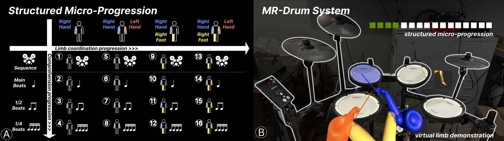
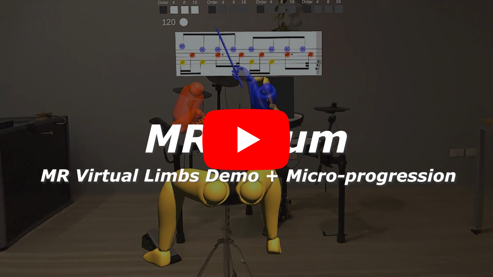

<div id="top">

<!-- HEADER STYLE: CLASSIC -->
<div align="center">


# ARDRUM-VIRTUALHAND

<em></em>

<!-- BADGES -->


<em>Built with the tools and technologies:</em>


</div>


<!-- default option, no dependency badges. -->


<!-- default option, no dependency badges. -->

</div>
<br>

---

## Table of Contents

- [Table of Contents](#table-of-contents)
- [Overview](#overview)
- [Features](#features)
- [Project Structure](#project-structure)
    - [Project Index](#project-index)
- [Getting Started](#getting-started)
    - [Prerequisites](#prerequisites)
    - [Installation](#installation)
    - [Usage](#usage)
    - [Testing](#testing)
- [Roadmap](#roadmap)
- [Contributing](#contributing)
- [License](#license)
- [Acknowledgments](#acknowledgments)

---

## Overview


ARDrum-VirtualHand is the implementation of the micro-progressed AR self-learning drumming system presented within a full paper in
ACM CHI 2025 [MR.Drum: Designing Mixed Reality Interfaces to Support Structured Learning Micro-Progression in Drumming](https://dl.acm.org/doi/10.1145/3706598.3714156).

The original paper introduced the idea of utilizing the concept of micro-progression to break through the long-standing challenge of using AR to learn/train complex (temporally and physically) skills, drumming, as an example.

As the research and evaluation are detailed in the paper, this document focuses on the system itself. The following sections will cover its features, project structure, and a brief overview of the codebase.

Let’s get started!

[ Teaser Video](https://www.youtube.com/watch?v=DkBCzBZu6SM)

---

## Features
Given a specified drumset pattern that the user want to learn as an input.
The system provide 3 feature phases: Record, Playback, Review.
Each phase support corresponding functionalities.

<table>
  <tr>
    <th>Record</th>
    <td>Record playing drum movement.
		<ul>
		<li>Supports different recording speed.</li>
		<li>Can later be playbacked as demonstration or review material.</li>
		</ul>
	</td>
  </tr>
  <tr>
    <th>Playback</th>
    <td>Practice playing the drumset pattern while watching drumming movement demonstrated by virtual limbs.
		<ul>
		<li>Customize the notes that users want to practice or skip, and the demonstration will adjust accordingly.</li>
		<li>Provide real-time visual feedback to users' performance.</li>
		<li>Users' playing drum movement and performance are also recored and used as review material in the review phase.</li>
		</ul>
	</td>
  </tr>
  <th>Review</th>
  <td>Review the performance correctness and compare practice movement with demonstration movement.
  <blockquote>⚠️ Review phase is still under beta testing and is not included in the paper.</blockquote>
  </td>
</table>


---

## Project Structure

```sh
ARDrum-VirtualHand/
└── Assets
    ├── BodyDisplayController.cs
    ├── Character/
    ├── CorrectRateCalculator.cs
    ├── CorrectRateDisplayer.cs
    ├── DisplayControl.cs
    ├── Drum Sheet/
    ├── Drum Video/
    ├── DrumHitIndicator.cs
    ├── DrumKit.cs
    ├── DrumNote.cs
    ├── DrumSheet.cs
    ├── DrumSheetCursor.cs
    ├── DrumSheetPlayer.cs
    ├── DrumStickPath/
    ├── DrumType.cs
    ├── DrumVideoPlayer.cs
    ├── Drum_SFX/
    ├── Editor
    │   └── BodyDisplayControllerDrawer.cs
    ├── Foot Magic Mirror/
    ├── HandFollowController.cs
    ├── HandMovementFeedback.cs
    ├── HandMovementPathRenderer.cs
    ├── Level Panel Button/
    ├── LevelController.cs
    ├── LevelManagementAnnouncement.cs
    ├── LevelManager.cs
    ├── Metronome/
    ├── Metronome.cs
    ├── MetronomeNote.cs
    ├── PhaseManager.cs
    ├── PhaseRunner.cs
    ├── PlayBackPhaseRunner.cs
    ├── PlayBackStatusVisualizer.cs
    ├── PracticeRecordPhaseRunner.cs
    ├── PracticeRecorder.cs
    ├── RealTimeInputLogSaver.cs
    ├── RealTimeInputTracker.cs
    ├── RecordPhaseRunner.cs
    ├── RecordStatusVisualizer.cs
    ├── RecordedPracticeTransforms/
    ├── RecordedTransforms/
    ├── ReviewManager.cs
    ├── ReviewPhaseRunner.cs
    ├── ReviewSheetDrawer.cs
    ├── Scenes
    │   ├── IK Rig_Controller.unity
    │   └── IK Rig_Hand.unity
    ├── SetDrumNoteSkipStateButton.cs
    ├── SetHitDrumCorrectMode.cs
    ├── StudyControl.cs
    ├── TransformPlayBacker.cs
    ├── TransformRecorder.cs
    ├── Virtual Drum/
    ├── Virtual Drum Sheet/
    ├── Virtual Limb Animation/
    ├── Virtual Video Panel/
    └── VirtualDrumController.cs
```

### Project Index

<details open>
	<summary><b><code>ARDRUM-VIRTUALHAND/</code></b></summary>
	<!-- Assets Submodule -->
	<details closed>
		<summary><b>Assets</b></summary>
		<blockquote>
			<div class='directory-path' style='padding: 8px 0; color: #666;'>
				<code><b>ARDRUM-VIRTUALHAND/Assets</b></code>
			<table style='width: 100%; border-collapse: collapse;'>
			<thead>
				<tr style='background-color: #f8f9fa;'>
					<th style='width: 30%; text-align: left; padding: 8px;'>File Name</th>
					<th style='text-align: left; padding: 8px;'>Summary</th>
				</tr>
			</thead>
				<tr style='border-bottom: 1px solid #eee;'>
					<td style='padding: 8px;'><b><a href='https://github.com/wayne0419/ARDrum-VirtualHand/blob/master/Assets/SetDrumNoteSkipStateButton.cs'>SetDrumNoteSkipStateButton.cs</a></b></td>
					<td style='padding: 8px;'>Enable dynamic control over which drum notes or limb movements should be skipped during playback by linking UI buttons or input actions to specific selection modes. <code>SetDrumNoteSkipStateButton.cs</code> maps user interactions to skip-state toggling for individual limbs, drum types, beat ranges, or predefined practice configurations. It plays a key role in customizing the playback experience through the <code>TransformPlayBacker</code>'s <code>DrumSheet</code>, facilitating targeted practice and error isolation in the self-learning drumming system.</td>
				</tr>
				<tr style='border-bottom: 1px solid #eee;'>
					<td style='padding: 8px;'><b><a href='https://github.com/wayne0419/ARDrum-VirtualHand/blob/master/Assets/LevelManagementAnnouncement.cs'>LevelManagementAnnouncement.cs</a></b></td>
					<td style='padding: 8px;'>Displays a flashing on-screen announcement when a level is passed, enhancing player feedback and reinforcing progress. It subscribes to <code>LevelManager</code>’s <code>OnLevelPassed</code> event and temporarily toggles the visibility of a <code>TextMeshProUGUI</code> element to create a blinking visual cue. <code>LevelManagementAnnouncement.cs</code> serves as an immediate reward mechanism and complements the level progression system managed by <code>LevelManager</code>.</td>
				</tr>
				<tr style='border-bottom: 1px solid #eee;'>
					<td style='padding: 8px;'><b><a href='https://github.com/wayne0419/ARDrum-VirtualHand/blob/master/Assets/HandMovementPathRenderer.cs'>HandMovementPathRenderer.cs</a></b></td>
					<td style='padding: 8px;'>Visualizes and highlights recent left and right hand trajectories during playback by rendering motion paths with <code>LineRenderer</code> components. Anchored to the user’s virtual drumstick tips, the <code>HandMovementPathRenderer</code> system samples motion data before and after each detected drum hit to reconstruct motion arcs. It also identifies and stores key points such as start, end, and highest positions, enabling synchronized visual feedback when paired with <code>HandMovementFeedback</code>. This component enhances user understanding of spatial drumming accuracy and form.</td>
				</tr>
				<tr style='border-bottom: 1px solid #eee;'>
					<td style='padding: 8px;'><b><a href='https://github.com/wayne0419/ARDrum-VirtualHand/blob/master/Assets/MetronomeNote.cs'>MetronomeNote.cs</a></b></td>
					<td style='padding: 8px;'>Visualizes metronome beats during playback by toggling visual states of note indicators in sync with rhythm cues. The <code>MetronomeNote</code> class, used by <code>Metronome</code>, changes color between <code>onColor</code> and <code>highlightColor</code> to signal active beats, helping learners anticipate timing. As part of the broader beat guidance system, <code>MetronomeNote.cs</code> supports rhythm accuracy through clear, time-aligned visual feedback.</td>
				</tr>
				<tr style='border-bottom: 1px solid #eee;'>
					<td style='padding: 8px;'><b><a href='https://github.com/wayne0419/ARDrum-VirtualHand/blob/master/Assets/ReviewManager.cs'>ReviewManager.cs</a></b></td>
					<td style='padding: 8px;'>Enable detailed comparison between user and target drum performances by extracting and aligning hit data from recorded transform files. <code>ReviewManager</code> loads user and target recordings, adjusts their timestamps to a common BPM, and separates each drum’s hit events into categorized lists. These lists support downstream visualization and accuracy assessment, making <code>ReviewManager.cs</code> central to performance review and error analysis in the Review phase.</td>
				</tr>
				<tr style='border-bottom: 1px solid #eee;'>
					<td style='padding: 8px;'><b><a href='https://github.com/wayne0419/ARDrum-VirtualHand/blob/master/Assets/TransformRecorder.cs'>TransformRecorder.cs</a></b></td>
					<td style='padding: 8px;'>Capture and store synchronized spatial and input data for virtual limb drumming practice.The <code>TransformRecorder</code> component in <code>TransformRecorder.cs</code> logs position, rotation, and drum hit data for three tracked limbs in sync with a metronome’s BPM. It enables configurable delays, integrates footstep animations, and outputs the results as JSON. Closely tied to <code>TransformPlayBacker</code> and input tracking, it is essential for generating structured training datasets and enabling data-driven performance playback.</td>
				</tr>
				<tr style='border-bottom: 1px solid #eee;'>
					<td style='padding: 8px;'><b><a href='https://github.com/wayne0419/ARDrum-VirtualHand/blob/master/Assets/PracticeRecorder.cs'>PracticeRecorder.cs</a></b></td>
					<td style='padding: 8px;'>Coordinates synchronized playback and recording of drumming practice sessions by continuously looping between them. The component activates both <code>TransformPlayBacker</code> and <code>TransformRecorder</code>, playing back a target demonstration while simultaneously recording the user's performance after a configurable delay. Triggered via the space key, it enables and disables this looped behavior, forming the core of the <code>PracticeRecord</code> phase in the project’s learning flow.</td>
				</tr>
				<tr style='border-bottom: 1px solid #eee;'>
					<td style='padding: 8px;'><b><a href='https://github.com/wayne0419/ARDrum-VirtualHand/blob/master/Assets/CorrectRateCalculator.cs'>CorrectRateCalculator.cs</a></b></td>
					<td style='padding: 8px;'>Calculates rhythm accuracy across multiple beat structures and limb combinations by analyzing real-time user input against expected drum note segments. Feeds results to other systems like <code>LevelManager</code> and <code>CorrectRateDisplayer</code> through a comprehensive set of metrics and events. Acts as the core evaluator for player correctness, supporting adaptive feedback and stage unlocking mechanisms based on nuanced timing and rhythm error classification.
</td>
				</tr>
				<tr style='border-bottom: 1px solid #eee;'>
					<td style='padding: 8px;'><b><a href='https://github.com/wayne0419/ARDrum-VirtualHand/blob/master/Assets/HandFollowController.cs'>HandFollowController.cs</a></b></td>
					<td style='padding: 8px;'>Synchronizes virtual hand models with tracked controller positions in real time to ensure accurate representation of user hand movements during drumming practice. By continuously updating the hand transforms each frame, <code>HandFollowController</code> supports immersive feedback and alignment between the user's physical actions and the virtual limb demonstrations. This functionality is foundational for maintaining spatial consistency within the AR/VR drumming environment.</td>
				</tr>
				<tr style='border-bottom: 1px solid #eee;'>
					<td style='padding: 8px;'><b><a href='https://github.com/wayne0419/ARDrum-VirtualHand/blob/master/Assets/LevelManager.cs'>LevelManager.cs</a></b></td>
					<td style='padding: 8px;'>Manages multi-stage drumming progression by coordinating stage focus, level unlocks, and level pass transitions based on real-time input accuracy and BPM performance. Tracks correct rates for specific rhythm patterns through integration with <code>CorrectRateCalculator</code>, and automatically triggers stage advancement when all focused levels meet criteria. Also provides feedback via events (<code>OnLevelPassed</code>, <code>OnStageAdvanced</code>) to update UI or trigger animations.</td>
				</tr>
				<tr style='border-bottom: 1px solid #eee;'>
					<td style='padding: 8px;'><b><a href='https://github.com/wayne0419/ARDrum-VirtualHand/blob/master/Assets/PhaseManager.cs'>PhaseManager.cs</a></b></td>
					<td style='padding: 8px;'>Orchestrates phase transitions between key learning states—<code>Record</code>, <code>PlayBack</code>, <code>PracticeRecord</code>, and <code>Review</code>—by managing their associated runners and lifecycle control. <code>PhaseManager</code> acts as a central controller that interprets keyboard input to switch phases, ensuring that only one phase runs at a time. This modular design supports seamless mode switching and enforces consistent behavior across the different learning phases.</td>
				</tr>
				<tr style='border-bottom: 1px solid #eee;'>
					<td style='padding: 8px;'><b><a href='https://github.com/wayne0419/ARDrum-VirtualHand/blob/master/Assets/VirtualDrumController.cs'>VirtualDrumController.cs</a></b></td>
					<td style='padding: 8px;'>Control the visibility of virtual drum GameObjects during practice by toggling their active state through user input. <code>VirtualDrumController</code> listens to an assigned input action and enables or disables a list of visual drum models accordingly. It supports dynamic switching between physical and virtual drum modes, enhancing user customization and streamlining the alignment between virtual and physical drumsets.</td>
				</tr>
				<tr style='border-bottom: 1px solid #eee;'>
					<td style='padding: 8px;'><b><a href='https://github.com/wayne0419/ARDrum-VirtualHand/blob/master/Assets/DrumNote.cs'>DrumNote.cs</a></b></td>
					<td style='padding: 8px;'>Represents individual drum notes in the visual drum sheet, each linked to a specific hit segment with metadata like drum type, beat position, and skip state. Supports toggling skip status interactively via mouse click, which updates both the visual color and underlying hit segment logic. Enables granular control over which notes are included in correctness calculations, making <code>DrumNote</code> essential for review and customization workflows in self-learning and performance feedback.</td>
				</tr>
				<tr style='border-bottom: 1px solid #eee;'>
					<td style='padding: 8px;'><b><a href='https://github.com/wayne0419/ARDrum-VirtualHand/blob/master/Assets/PlayBackStatusVisualizer.cs'>PlayBackStatusVisualizer.cs</a></b></td>
					<td style='padding: 8px;'>Visualizes the playback state of the drumming demonstration system by updating the color of a designated sphere. The <code>PlayBackStatusVisualizer</code> component listens to events from <code>TransformPlayBacker</code> and provides immediate visual feedback—green when idle, red when playing—indicating whether a virtual limb performance is actively being demonstrated. This enhances clarity and user awareness during self-learning sessions.</td>
				</tr>
				<tr style='border-bottom: 1px solid #eee;'>
					<td style='padding: 8px;'><b><a href='https://github.com/wayne0419/ARDrum-VirtualHand/blob/master/Assets/BodyDisplayController.cs'>BodyDisplayController.cs</a></b></td>
					<td style='padding: 8px;'>Controls the color display of grouped body parts in the 3D avatar visualization system. Each group in <code>BodyDisplayController</code> represents a set of renderers that can be individually tinted. Supports both opaque and transparent rendering, enabling dynamic visual feedback. Integrates with Unity’s rendering pipeline and editor tooling for real-time updates, enhancing clarity in drumming demonstrations or feedback visualization.</td>
				</tr>
				<tr style='border-bottom: 1px solid #eee;'>
					<td style='padding: 8px;'><b><a href='https://github.com/wayne0419/ARDrum-VirtualHand/blob/master/Assets/TransformPlayBacker.cs'>TransformPlayBacker.cs</a></b></td>
					<td style='padding: 8px;'>Replays recorded limb movements and drum hit data using time-based transform interpolation in <code>TransformPlayBacker</code>, enabling synchronized playback of visual and auditory cues for drumming practice. Acts as the central playback engine, coordinating with components like <code>DrumSheet</code>, <code>Metronome</code>, and <code>DrumNote</code> to control timing, visual progression, and note interaction. Powers features such as beat-based playback, segment skipping, and virtual limb alignment for effective self-learning.</td>
				</tr>
				<tr style='border-bottom: 1px solid #eee;'>
					<td style='padding: 8px;'><b><a href='https://github.com/wayne0419/ARDrum-VirtualHand/blob/master/Assets/DrumHitIndicator.cs'>DrumHitIndicator.cs</a></b></td>
					<td style='padding: 8px;'>Visualizes drum hit feedback by displaying and fading color-coded indicators for each drum component in real time. Each <code>DrumHitIndicator</code> responds to user input by briefly highlighting the hit area based on the triggering limb (left hand, right hand, or unspecified). Integrates with the input tracking and playback system to provide immediate visual cues for self-assessment, enhancing the drumming practice experience through embodied interaction.</td>
				</tr>
				<tr style='border-bottom: 1px solid #eee;'>
					<td style='padding: 8px;'><b><a href='https://github.com/wayne0419/ARDrum-VirtualHand/blob/master/Assets/ReviewSheetDrawer.cs'>ReviewSheetDrawer.cs</a></b></td>
					<td style='padding: 8px;'>Visualizes and compares user and target drumming performances by drawing hit points on a 3D review sheet. <code>ReviewSheetDrawer</code> leverages data from <code>ReviewManager</code> to instantiate visual markers for each drum hit type, using spatial positioning and color to distinguish between user and target inputs. This aids in post-session review by providing an intuitive, layered timeline of drumming accuracy across all instruments.</td>
				</tr>
				<tr style='border-bottom: 1px solid #eee;'>
					<td style='padding: 8px;'><b><a href='https://github.com/wayne0419/ARDrum-VirtualHand/blob/master/Assets/CorrectRateDisplayer.cs'>CorrectRateDisplayer.cs</a></b></td>
					<td style='padding: 8px;'>Displays real-time drumming accuracy metrics to the user by subscribing to calculation results from <code>CorrectRateCalculator</code> and updating multiple <code>TextMeshProUGUI</code> fields. Enables learners to visualize detailed feedback for different rhythm categories (e.g., right-hand 4-beat, both-hand 16-beat) across various difficulty levels. Serves as a critical feedback interface that supports performance tracking and progression logic used in the <code>LevelManager</code>.</td>
				</tr>
				<tr style='border-bottom: 1px solid #eee;'>
					<td style='padding: 8px;'><b><a href='https://github.com/wayne0419/ARDrum-VirtualHand/blob/master/Assets/RealTimeInputTracker.cs'>RealTimeInputTracker.cs</a></b></td>
					<td style='padding: 8px;'>Tracks and evaluates real-time drum inputs during playback to determine user performance accuracy. Tightly integrated with <code>TransformPlayBacker</code>, <code>RealTimeInputTracker</code> logs input events, compares them against pre-defined hit segments, and visually marks correct, near-correct, missed, or incorrect hits using configurable thresholds. Supports two evaluation modes—timing-based and order-based—and triggers feedback through marker instantiation. Crucial for enabling interactive drumming practice with immediate feedback.</td>
				</tr>
				<tr style='border-bottom: 1px solid #eee;'>
					<td style='padding: 8px;'><b><a href='https://github.com/wayne0419/ARDrum-VirtualHand/blob/master/Assets/RecordPhaseRunner.cs'>RecordPhaseRunner.cs</a></b></td>
					<td style='padding: 8px;'>Activate the recording phase by toggling the <code>TransformRecorder</code> GameObject, enabling or disabling motion and drum hit data capture in sync with the session. <code>RecordPhaseRunner</code> extends the abstract <code>PhaseRunner</code> and integrates with <code>PhaseManager</code> to coordinate user-triggered phase transitions. It ensures clean lifecycle control for recording input and motion data, serving as a foundation for subsequent playback and review phases.</td>
				</tr>
				<tr style='border-bottom: 1px solid #eee;'>
					<td style='padding: 8px;'><b><a href='https://github.com/wayne0419/ARDrum-VirtualHand/blob/master/Assets/DrumSheetCursor.cs'>DrumSheetCursor.cs</a></b></td>
					<td style='padding: 8px;'>Animates a visual cursor across the drum sheet during playback, representing the current time progression of the practice session. By synchronizing with <code>TransformPlayBacker</code>, it smoothly interpolates the cursor's position between predefined start and end anchors defined in the <code>DrumSheet</code>. This aids users in visually tracking the current beat position in real-time, enhancing temporal awareness during drumming practice.</td>
				</tr>
				<tr style='border-bottom: 1px solid #eee;'>
					<td style='padding: 8px;'><b><a href='https://github.com/wayne0419/ARDrum-VirtualHand/blob/master/Assets/HandMovementFeedback.cs'>HandMovementFeedback.cs</a></b></td>
					<td style='padding: 8px;'>Visualizes real-time feedback on hand movement accuracy during playback by comparing the user's drumstick tip positions with predefined key points—start, peak, and end—on the recorded trajectory. It highlights correctly timed and positioned gestures in green and resets the color upon drum hits, helping learners evaluate their motion precision. This component, <code>HandMovementFeedback</code>, plays a crucial role in supporting motor learning by bridging spatial and temporal alignment with expert demonstrations.</td>
				</tr>
				<tr style='border-bottom: 1px solid #eee;'>
					<td style='padding: 8px;'><b><a href='https://github.com/wayne0419/ARDrum-VirtualHand/blob/master/Assets/SetHitDrumCorrectMode.cs'>SetHitDrumCorrectMode.cs</a></b></td>
					<td style='padding: 8px;'>Enable dynamic switching between rhythm- and order-based correctness evaluation modes during playback-based drumming practice. <code>SetHitDrumCorrectMode.cs</code> listens for an input action and updates the mode of the <code>RealTimeInputTracker</code>, allowing users or researchers to toggle between time-sensitive accuracy assessment and beat-order matching. This supports comparative studies or adaptive feedback mechanisms by altering how input correctness is determined mid-session.</td>
				</tr>
				<tr style='border-bottom: 1px solid #eee;'>
					<td style='padding: 8px;'><b><a href='https://github.com/wayne0419/ARDrum-VirtualHand/blob/master/Assets/DisplayControl.cs'>DisplayControl.cs</a></b></td>
					<td style='padding: 8px;'>Toggle visibility of grouped renderers using keypad input, enabling users to control which visual elements are active during drumming practice or playback. <code>DisplayControl</code> facilitates flexible scene visualization by managing three independent lists of <code>GameObject</code>s, allowing learners or researchers to isolate or combine display layers—such as virtual limbs, feedback elements, or reference visuals—based on user interaction needs or study conditions.</td>
				</tr>
				<tr style='border-bottom: 1px solid #eee;'>
					<td style='padding: 8px;'><b><a href='https://github.com/wayne0419/ARDrum-VirtualHand/blob/master/Assets/DrumSheetPlayer.cs'>DrumSheetPlayer.cs</a></b></td>
					<td style='padding: 8px;'>Synchronizes <code>DrumSheetPlayer</code> drum sheet video playback with the practice session by adjusting playback speed and start time based on BPM and beat offset. Acts as a controller for aligning visual rhythm guidance with user performance, making it an essential component for timing-accurate drumming practice. Integrates closely with <code>TransformPlayBacker</code> and rhythm feedback systems to ensure consistent temporal alignment during training.</td>
				</tr>
				<tr style='border-bottom: 1px solid #eee;'>
					<td style='padding: 8px;'><b><a href='https://github.com/wayne0419/ARDrum-VirtualHand/blob/master/Assets/ReviewPhaseRunner.cs'>ReviewPhaseRunner.cs</a></b></td>
					<td style='padding: 8px;'>Coordinate the activation of the <code>ReviewPhaseRunner</code> phase by enabling the <code>ReviewManager</code> component, which loads and aligns user and target drumming performance data for comparison. <code>ReviewPhaseRunner</code> integrates into the unified <code>PhaseManager</code> system by extending the <code>PhaseRunner</code> base class, allowing the review phase to be toggled alongside recording and playback phases. Its activation triggers visualizations and statistical feedback, supporting users in self-evaluating their performance.</td>
				</tr>
				<tr style='border-bottom: 1px solid #eee;'>
					<td style='padding: 8px;'><b><a href='https://github.com/wayne0419/ARDrum-VirtualHand/blob/master/Assets/LevelController.cs'>LevelController.cs</a></b></td>
					<td style='padding: 8px;'>Defines the visual state and progression logic for individual rhythm training levels within a stage. Each <code>LevelController</code> can be marked as locked, focused, or passed, with corresponding visual feedback using color changes. It also associates each level with a specific drumming accuracy metric (<code>TrackCorrectRate</code>) to evaluate user performance. Serves as a key component in the <code>LevelManager</code> system to guide and track user progress through structured practice stages.</td>
				</tr>
				<tr style='border-bottom: 1px solid #eee;'>
					<td style='padding: 8px;'><b><a href='https://github.com/wayne0419/ARDrum-VirtualHand/blob/master/Assets/RecordStatusVisualizer.cs'>RecordStatusVisualizer.cs</a></b></td>
					<td style='padding: 8px;'>Visualizes real-time recording status during drum data capture by dynamically changing a color-coded sphere. <code>RecordStatusVisualizer</code> reflects three distinct states—standby (green), recording delay (yellow), and active recording (red)—based on the status of the <code>TransformRecorder</code> component. Integrated into the recording phase of the system, this visual cue enhances user awareness and debugging of recording states within the self-learning drumming application.</td>
				</tr>
				<tr style='border-bottom: 1px solid #eee;'>
					<td style='padding: 8px;'><b><a href='https://github.com/wayne0419/ARDrum-VirtualHand/blob/master/Assets/DrumVideoPlayer.cs'>DrumVideoPlayer.cs</a></b></td>
					<td style='padding: 8px;'>Toggles playback of a drum demonstration video based on user input, serving as a simple visual reference for drumming performance. Integrated via Unity’s <code>VideoPlayer</code>, <code>DrumVideoPlayer</code> supports starting and stopping the video using the <code>Z</code> key. Useful for augmenting the practice experience by providing an example to follow alongside interactive or system-guided feedback.</td>
				</tr>
				<tr style='border-bottom: 1px solid #eee;'>
					<td style='padding: 8px;'><b><a href='https://github.com/wayne0419/ARDrum-VirtualHand/blob/master/Assets/PracticeRecordPhaseRunner.cs'>PracticeRecordPhaseRunner.cs</a></b></td>
					<td style='padding: 8px;'>Coordinates the <code>Practice Record</code> phase by enabling the <code>PracticeRecorder</code> GameObject, which simultaneously plays back a virtual drum demonstration and records the user's drumming performance. As part of the phase management system, it allows toggling this synchronized play-record loop and ensures that the corresponding components are activated or deactivated at the right time.</td>
				</tr>
				<tr style='border-bottom: 1px solid #eee;'>
					<td style='padding: 8px;'><b><a href='https://github.com/wayne0419/ARDrum-VirtualHand/blob/master/Assets/Metronome.cs'>Metronome.cs</a></b></td>
					<td style='padding: 8px;'>Coordinates audio playback, visual cues, and playback BPM synchronization for rhythmic guidance. The <code>Metronome</code> component plays distinct sounds for downbeats and subbeats based on the selected mode (4-beat or 16-beat), visually highlights beat positions using <code>MetronomeNote</code> elements, and adjusts behavior dynamically with <code>TransformPlayBacker</code> events. It enhances temporal alignment for practice sessions and supports tempo control during playback.</td>
				</tr>
				<tr style='border-bottom: 1px solid #eee;'>
					<td style='padding: 8px;'><b><a href='https://github.com/wayne0419/ARDrum-VirtualHand/blob/master/Assets/DrumKit.cs'>DrumKit.cs</a></b></td>
					<td style='padding: 8px;'>Simulates drum sound playback based on user input actions by mapping input events to corresponding <code>AudioSource</code> components. Acts as the auditory output layer of the system, enabling real-time feedback for each drum component including bass, snare, toms, hi-hats, and cymbals. Integrates with Unity's Input System and complements visual feedback components to create an immersive and responsive drumming experience.</td>
				</tr>
				<tr style='border-bottom: 1px solid #eee;'>
					<td style='padding: 8px;'><b><a href='https://github.com/wayne0419/ARDrum-VirtualHand/blob/master/Assets/PlayBackPhaseRunner.cs'>PlayBackPhaseRunner.cs</a></b></td>
					<td style='padding: 8px;'>Orchestrates the playback phase by toggling the <code>TransformPlayBacker</code> component, enabling the system to visualize recorded drum movements. Serves as the concrete implementation of the abstract <code>PhaseRunner</code> base class for playback functionality. Controlled by the central <code>PhaseManager</code>, <code>PlayBackPhaseRunner</code> ensures modular phase transitions within the drumming learning workflow and integrates seamlessly into the phase-based system architecture.</td>
				</tr>
				<tr style='border-bottom: 1px solid #eee;'>
					<td style='padding: 8px;'><b><a href='https://github.com/wayne0419/ARDrum-VirtualHand/blob/master/Assets/StudyControl.cs'>StudyControl.cs</a></b></td>
					<td style='padding: 8px;'>Toggle-based mode controller for study conditions—<code>StudyControl.cs</code> switches between <code>MRDrum</code> and baseline modes by activating or deactivating corresponding <code>GameObject</code>s. Enables comparative analysis of user experience or performance across conditions within the drumming self-learning system.</td>
				</tr>
				<tr style='border-bottom: 1px solid #eee;'>
					<td style='padding: 8px;'><b><a href='https://github.com/wayne0419/ARDrum-VirtualHand/blob/master/Assets/RealTimeInputLogSaver.cs'>RealTimeInputLogSaver.cs</a></b></td>
					<td style='padding: 8px;'>Log real-time drumming input data for post-practice analysis by saving user performance metrics—including drum hit events, playback tempo, and accuracy rate—into structured JSON files. Integrated with <code>RealTimeInputTracker</code> and <code>CorrectRateCalculator</code>, the <code>RealTimeInputLogSaver</code> component enables manual export of user performance data via a keypress, supporting data-driven feedback and progress tracking across sessions.</td>
				</tr>
				<tr style='border-bottom: 1px solid #eee;'>
					<td style='padding: 8px;'><b><a href='https://github.com/wayne0419/ARDrum-VirtualHand/blob/master/Assets/DrumType.cs'>DrumType.cs</a></b></td>
					<td style='padding: 8px;'>Defines the <code>DrumType</code> enumeration used throughout the system to classify different drum components—such as snare, bass drum, hi-hats, toms, crash, and ride cymbals. Serves as a standardized reference to ensure consistent identification of drum parts across modules including audio playback, hit tracking, visualization, and scoring logic. It underpins functionalities like input handling, feedback rendering, and rhythm analysis by unifying drum element representation.</td>
				</tr>
				<tr style='border-bottom: 1px solid #eee;'>
					<td style='padding: 8px;'><b><a href='https://github.com/wayne0419/ARDrum-VirtualHand/blob/master/Assets/PhaseRunner.cs'>PhaseRunner.cs</a></b></td>
					<td style='padding: 8px;'>Defines the abstract base class for managing different learning phases in the drumming system. <code>PhaseRunner</code> establishes a consistent interface with <code>StartPhaseRunner</code> and <code>StopPhaseRunner</code> methods, enabling specific phase implementations like recording, playback, practice, and review to be controlled uniformly. It plays a central architectural role by standardizing phase behavior across the modular training framework.</td>
				</tr>
				<tr style='border-bottom: 1px solid #eee;'>
					<td style='padding: 8px;'><b><a href='https://github.com/wayne0419/ARDrum-VirtualHand/blob/master/Assets/DrumSheet.cs'>DrumSheet.cs</a></b></td>
					<td style='padding: 8px;'>Manages the <code>DrumSheet</code> notation layout and interaction logic by organizing all <code>DrumNote</code>s on a virtual sheet and anchoring each <code>DrumType</code> to specific rows. Enables precise control over the skip state of individual notes based on criteria such as drum type, beat position, or limb used. This component is essential for dynamic playback customization, user error review, and selective feedback in the drumming self-learning system.</td>
				</tr>
			</table>
			<!-- Editor Submodule -->
			<details open>
				<summary><b>Editor</b></summary>
				<blockquote>
					<div class='directory-path' style='padding: 8px 0; color: #666;'>
						<code><b>ARDRUM-VIRTUALHAND/Assets/Editor</b></code>
					<table style='width: 100%; border-collapse: collapse;'>
					<thead>
						<tr style='background-color: #f8f9fa;'>
							<th style='width: 30%; text-align: left; padding: 8px;'>File Name</th>
							<th style='text-align: left; padding: 8px;'>Summary</th>
						</tr>
					</thead>
						<tr style='border-bottom: 1px solid #eee;'>
							<td style='padding: 8px;'><b><a href='https://github.com/wayne0419/ARDrum-VirtualHand/blob/master/Assets/Editor/BodyDisplayControllerDrawer.cs'>BodyDisplayControllerDrawer.cs</a></b></td>
							<td style='padding: 8px;'>Provides a custom Unity editor interface for visualizing and modifying <code>BodyGroup</code> properties in the <code>BodyDisplayController</code> component. Enhances the inspector interface by allowing intuitive editing of group names, associated renderers, and colors. Automatically triggers live updates to the corresponding body group’s visual appearance when colors are changed, streamlining the workflow for managing avatar visualization in the drumming training system.
</td>
						</tr>
					</table>
				</blockquote>
			</details>
		</blockquote>
	</details>
</details>

---

## Getting Started

### Prerequisites

This project requires the following dependencies:

- **Programming Language:** C#
- Unity 2022.3.34f1 or later
- Quest Link PCVR
- Quest 3 HMD or later version that supports passthrough
- Electronic Drum Kit or any MIDI input device, I use Roland Td-1dmk for development

### Installation

Build ARDrum-VirtualHand from the source:

1. **Clone the repository:**

    ```sh
    ❯ git clone https://github.com/wayne0419/ARDrum-VirtualHand
    ```

2. **Open with Unity Engine**

3. **Open Scene ```IK Rig_Controller.unity```**

4. **Make any adjustment that you want to**

### Usage - Record
There are two ways to use the record phase features:

1. Record in the buid application.
2. Record in the Unity editor.

To record in the buid application:

1. **Follow [Usage - Playback Section](#Usage---Playback) step 1~5**

2. **Enter record phase**

	Press number 0 on your pc keyboard (the number 0 on the top, not the number pad) to enter record phase.

3. **Check record status**

	The color of the big sphere in the front shows the record status.
	<table>
	<tr>
	<th>🟢</th>
	<td>Idling.</td>
	</tr>
	<tr>
	<th>🟡</th>
	<td>Ready. <blockquote>After pressing the start record button, the system goes into this state for 4 beats before entering into the recording state.</blockquote></td>
	</tr>
	<tr>
	<th>🔴</th>
	<td>Recording.</td>
	</tr>
	</table>

4. **Record phase control scheme**
	| Functionality | Key Binding |
	|---|---|
	| Start record | Space |
	| Speed up/down record tempo | Mousepad +/- |

5. **Record whatever you want**

	The recording are stored inside ```Assets/RecordedTransforms```.

6. **Switch the recording for playback**
	
	After completing a recording, the latest recording will be automatically assigned as the playback material. To change the recording, in the Unity editor, go to ```Scene Root object -> PlayBackPhaseRunner object-> TransformPlayBacker Object -> TransformPlayBacker component``` and adjust the ```Json File Path``` property.

### Usage - Playback

1. **Build the application**

	Inside Unity Engine, select File -> Build Settings -> Windows, Mac, Linux -> Build

2. **Copy directory ```Assets -> RecordedTransforms``` into the build folder**

	```sh
    The file structure of your build folder should look like this

	<Your build folder>
    ├── Assets
    │    └── RecorderTransforms
	│           └── <at least one recording .json file>
	├── ARDrum-VirtualHand.exe
	└── ...
    ```
3. **Connect HMD with PC through Quest Link**
4. **Execute ```ARDrum-VirtualHand.exe```**
5. **Align physical and virtual drumsets**

	Use Quest controller button B to turn on a white virtual drumset, and align with your own physical drumset, then press button B again to turn it off.

6. **Enter playback phase**

	Press number 1 on your pc keyboard (the number 1 on the top, not the number pad) to enter playback phase.

7. **Playback phase control scheme**
	| Functionality | Key Binding |
	|---|---|
	| Start/Stop playback | Space |
	| Speed up/down tempo | Mousepad +/- |
	| Skip/Unskip a music note | Click on that note on the drum sheet. |
	| Use playback preset | AQWEFRTYJUIO;P[] |

<!-- ### Testing

Ardrum-virtualhand uses the {__test_framework__} test framework. Run the test suite with:

echo 'INSERT-TEST-COMMAND-HERE' -->

<!-- --- -->

<!-- ## Roadmap

- [X] **`Task 1`**: <strike>Implement feature one.</strike>
- [ ] **`Task 2`**: Implement feature two.
- [ ] **`Task 3`**: Implement feature three. -->

---

## Contributing

- **💬 [Join the Discussions](https://github.com/wayne0419/ARDrum-VirtualHand/discussions)**: Share your insights, provide feedback, or ask questions.
- **🐛 [Report Issues](https://github.com/wayne0419/ARDrum-VirtualHand/issues)**: Submit bugs found or log feature requests for the `ARDrum-VirtualHand` project.
- **💡 [Submit Pull Requests](https://github.com/wayne0419/ARDrum-VirtualHand/blob/main/CONTRIBUTING.md)**: Review open PRs, and submit your own PRs.

<details closed>
<summary>Contributing Guidelines</summary>

1. **Fork the Repository**: Start by forking the project repository to your github account.
2. **Clone Locally**: Clone the forked repository to your local machine using a git client.
   ```sh
   git clone https://github.com/wayne0419/ARDrum-VirtualHand
   ```
3. **Create a New Branch**: Always work on a new branch, giving it a descriptive name.
   ```sh
   git checkout -b new-feature-x
   ```
4. **Make Your Changes**: Develop and test your changes locally.
5. **Commit Your Changes**: Commit with a clear message describing your updates.
   ```sh
   git commit -m 'Implemented new feature x.'
   ```
6. **Push to github**: Push the changes to your forked repository.
   ```sh
   git push origin new-feature-x
   ```
7. **Submit a Pull Request**: Create a PR against the original project repository. Clearly describe the changes and their motivations.
8. **Review**: Once your PR is reviewed and approved, it will be merged into the main branch. Congratulations on your contribution!
</details>

<details open>
<summary>Contributor Graph</summary>
<br>
<p align="left">
   <a href="https://github.com{/wayne0419/ARDrum-VirtualHand/}graphs/contributors">
      
   </a>
</p>
</details>

---

## License

Ardrum-virtualhand is protected under the Apache-2.0 License. For more details, refer to the [LICENSE](https://choosealicense.com/licenses/) file.

---

## Acknowledgments

- [Minis: MIDI input extension for Unity Input System](https://github.com/keijiro/Minis) by Keijiro

<div align="right">

[![][back-to-top]](#top)

</div>


[back-to-top]: https://img.shields.io/badge/-BACK_TO_TOP-151515?style=flat-square


---
